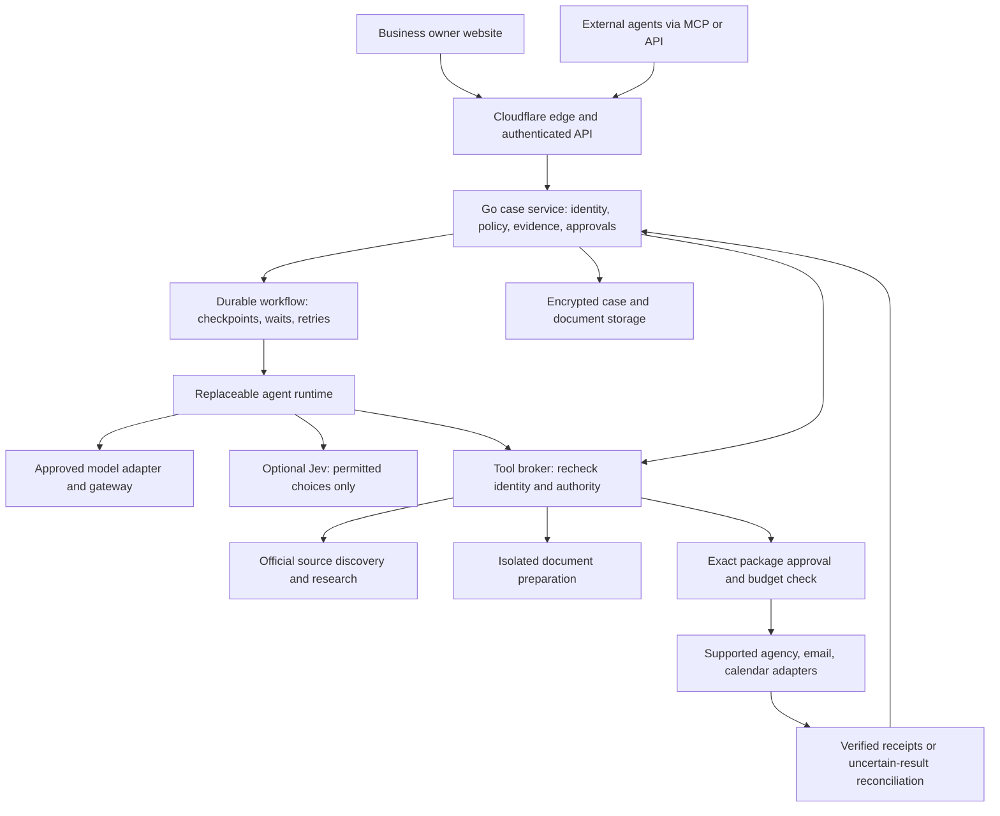

# Agent harness, deployment, and security decision

Research date: September 20, 2026. Implementation assessed: `786b017cef2e6aa1b9f6c2fbbe1ea43170d2759b` on `feat/production-platform`. This document proposes the next architecture; it does not certify a deployment or claim these controls are implemented. Permits Agent is the product; Permits N More is its first customer. Statewide scope and the outstanding coverage work remain in [commercial readiness](commercial-readiness.md).

## Recommendation

Keep the Go case service and tool API as the authority for customer records, permissions, evidence, approvals, and accounting. Put a replaceable agent runtime behind that service. Add durable workflow execution for work that must survive a request, restart, or days of waiting. Models and runtimes may propose actions; only the application can authorize and execute them.

Use Cloudflare as the preferred deployment direction for the edge, model gateway, and a small Workflows orchestration layer. Keep the existing Go service on a private origin with durable storage. This is a recommendation based on the existing code and hosting preference, not a verified account configuration or a decision to rewrite the application in Workers. Use Temporal with Go workers instead if a separate TypeScript orchestration service or Cloudflare's deployment/data constraints fail the pilot gates. Choose one durable workflow engine, not both.

Retain the bounded Responses loop as the baseline while separating its responsibilities. Evaluate self-hosted Codex App Server as the richer harness candidate through the same restricted tools. Use Jev only for bounded classification/ranking after application policy filters the options. Do not make a production framework switch until the comparison below passes the same synthetic acceptance suite.

Everything after the current request-driven research loop is target architecture. In particular, durable runs, Jev, Codex integration, document processing, and external execution do not exist in the candidate.

## What the researched platforms actually provide

| Option | What it supplies | Fit and remaining responsibility |
|---|---|---|
| Palantir AIP / Foundry / Apollo | Ontology-backed data and actions, agent applications, governance and deployment infrastructure | Adopt the permissioned object/action pattern. Buying the platform would require a separate commercial and integration evaluation; no cost comparison or account access was established. |
| Self-hosted Codex App Server | Agent loop, conversation history, streamed events, tool integration and approval requests | Strong candidate for a rich embedded agent. Run behind our server, with isolated execution and a restricted protocol facade. The application still owns customer authorization and case completion. |
| OpenAI managed Agents API | Managed Codex harness, sessions, context compaction and recovery; hosted or self-hosted execution environments | Less runtime operation, but more provider-owned state. Current documentation says US residency only and no ZDR, including with a self-hosted sandbox. Not the default path for sensitive applicant records. |
| OpenAI Agents SDK | Application-hosted agent loop in TypeScript or Python, tools and orchestration | Useful if we adopt a TypeScript worker; not a drop-in Go library. It does not remove our storage, approval or lifecycle work. Python would conflict with the current native runtime contract. |
| Cloudflare Agents + Workflows | Stateful agents and durable multi-step jobs with waits and approval patterns | Preferred workflow proof of concept for the Cloudflare direction. A job wake-up must call our authorization service; a workflow event is not proof the owner approved anything. |
| Go service + Temporal | Go workflows, workers, timers and recovery; custom payload encryption | Strong alternative that preserves Go ownership of orchestration. Adds a workflow service and operating/commercial decisions. It is a workflow engine, not a model harness. |

Sources: [Palantir architecture](https://www.palantir.com/docs/foundry/architecture-center/aip-architecture), [Codex embedding overview](https://developers.openai.com/blog/codex-as-a-platform), [App Server](https://learn.chatgpt.com/docs/app-server), [Agents API](https://developers.openai.com/api/docs/guides/agents-api/overview), [Agents SDK](https://developers.openai.com/api/docs/guides/agents/sdk), [Cloudflare durable agents](https://developers.cloudflare.com/workflows/get-started/durable-agents/), [Cloudflare approval patterns](https://developers.cloudflare.com/agents/concepts/agentic-patterns/human-in-the-loop/), [Temporal Go guide](https://docs.temporal.io/develop/go).

### Palantir's pattern translated to this product

Represent Business, Premises, Jurisdiction, Agency, Requirement, FormVersion, Evidence, Case, DocumentPackage, Approval and SubmissionReceipt as explicit records with relationships, access rules and versions. A model's conversation is not the authoritative case record. For example, an Evidence record must distinguish a retrieved instruction from an applicant assertion and an agency-confirmed receipt.

Palantir's AI FDE documentation describes operations under the authenticated user's identity, server-side permission checks, consent for mutations and attributed audit events. Those are useful design properties to reproduce in our own services; they are not guarantees inherited by using an LLM. [AI FDE security and governance](https://www.palantir.com/docs/foundry/ai-fde/security-and-governance).

The boundary matters for our connector: Palantir explicitly notes that external MCP clients send tool output to their own model providers. Its granular object read filters also do not automatically protect downstream exports. For Permits Agent, access to a case and permission to export sensitive fields must be separate. Once an authorized external client receives plaintext, our server cannot enforce its subsequent retention or model use. [MCP security](https://www.palantir.com/docs/foundry/palantir-mcp/security), [object security limitations](https://www.palantir.com/docs/foundry/object-permissioning/managing-object-security).

### Codex integration boundary

For the first self-hosted experiment, connect our server to App Server over local stdio inside an isolated worker environment. Do not expose App Server directly to website users or arbitrary MCP clients. The current docs mark WebSocket transport unsupported/experimental, dynamic tools experimental, and some explicit shell/process methods outside the thread sandbox. Pin a tested release and expose only the lifecycle methods our backend needs. Prefer our existing MCP tools over experimental dynamic tools initially. [App Server protocol and caveats](https://learn.chatgpt.com/docs/app-server).

Our server must map authenticated tenant/case/run IDs to private runtime thread IDs, own the configuration, prohibit caller overrides of filesystem/network policy, and supply a short-lived case-scoped capability. Separate tenant execution environments, directories, caches and browser sessions. Keep provider and agency credentials outside model-readable environments. Disable arbitrary shell/browser access in the initial research pilot. A sandbox protects a host boundary; it does not implement all customer authorization rules. OpenAI's sandbox guidance also calls for isolated workloads, restricted egress and credential brokering. [Sandbox security](https://developers.openai.com/api/docs/guides/agents-api/environments/security).

Two interfaces are needed rather than one universal provider abstraction:

- `ModelAdapter`: one model request, validated tool proposals, answer, usage and provider continuation state. Provider-specific reasoning state stays tagged and encrypted; never assume it can be replayed into another model.
- `AgentRuntime`: start, continue, cancel and receive events from a multi-turn harness such as Codex. It invokes the same tool broker. Application-owned summaries and evidence IDs support migration; raw runtime threads are not a portable case database.

Changing model or harness must not change scopes, tenant access, data classification, approval requirements or spending limits. No automatic fallback to an unapproved provider when the chosen provider fails.

## Jev's role

TypeSafe documents Jev as an early-access model for structured decisions. Its Choice operation selects among supplied options and returns probabilities; it does not generate our filing narrative or establish legal authority. A valid option can still be the wrong decision. We should not repeat the vendor's broad reliability marketing as a measured property of this product. [Jev introduction](https://typesafe.ai/blog/introducing-system-one-models-and-jev), [API contract](https://docs.typesafe.ai/api).

Good initial tasks: route a sanitized request to an existing workflow, rank retrieved official forms, classify a document's type, or decide whether a request needs a stronger model or human review. Rules first eliminate unavailable, unauthorized and unsafe options. Always provide an abstain/escalate path. Jev must not establish jurisdiction, declare a requirement satisfied, approve a payment, authorize filing, or act as the only PII detector.

The production adapter should validate the returned candidate against the original set and a fresh state/version hash. Record rubric version, provider/model version, uncertainty, latency and cost without recording raw PII. Evaluate against labeled California scenarios and a deterministic baseline; measure serious mistakes, calibration and abstention rather than trusting a fixed confidence number. No Jev API calls or paid benchmark were made in this research.

TypeSafe says it does not train on API input, but its privacy policy describes collection of input, disclosure to service providers and retention as reasonably necessary. That is not a ZDR commitment. Start with public/synthetic material; review the actual data-processing agreement, subprocessors, deletion, security and incident terms before customer data. [TypeSafe privacy policy](https://typesafe.ai/legal/privacy-policy).

## Security control matrix

“Implemented” below describes inspected code and the candidate's existing synthetic tests, not a penetration test or production verification. Source anchors refer to that baseline: [server](../internal/platform/server.go), [store](../internal/platform/store.go), [assistant](../internal/platform/agent.go), [discovery](../internal/platform/discovery.go), [server tests](../internal/platform/server_test.go), [assistant tests](../internal/platform/agent_test.go). Existing validation is recorded in [verification](verification.md).

| Control | Current evidence | Required before relevant production use |
|---|---|---|
| Identity and tenancy | Hashed operator-issued bearer keys; tenant derived on server; tenant predicates and cross-tenant tests | Customer login, organization membership, per-person and per-client attribution, least-privilege roles, case grants, immediate revocation and audited support access |
| Tool authorization | Scope checks, argument validation, research allowlist; tests reject model mutations | Central policy decision on every execution and resume; policy/version record; separation of read, prepare, export, submit and administrative tools |
| Connector identity | Static bearer authentication; no OAuth discovery | Standards-based delegated authorization with audience/issuer/expiry validation, PKCE and client consent; tenant and case grants cannot be chosen by tool arguments |
| PII minimization | No DLP/redaction. Selected intake and latest three notes are sent to the configured provider | Field classification, purpose-limited context builder, secret/PII scanning, controlled rehydration for document output, approved provider/data-class registry and export policy |
| Encryption at rest | SQLite stores case JSON in plaintext; private file permissions are present | Verified encrypted database volume, snapshots/backups and objects; additional envelope encryption for sensitive applicant fields/documents with managed keys and rotation/restore evidence |
| Transport and secrets | HTTPS provider/source endpoints; bounded redirects; server-only model key; edge proxy artifact | Deployed TLS on each hop, private authenticated origin, production secret manager and rotation, egress restrictions and no secrets exposed to runtime code |
| Approvals | Model has no external execution tools; drafts and ICS exports only | Durable approval tied to exact package, recipient/destination, attachments, fee ceiling, authority and expiry; revalidate immediately before any effect |
| Execution recovery | Request/model reservations, idempotent case creation, version checks | Durable runs, operation IDs, outbox, authenticated deduplicated events, cancellation and uncertain-result reconciliation; no blind resubmission |
| Audit | Local audit rows and model/request usage; no immutable store or full attributed tool ledger | Actor/client/run/policy/tool versions, decisions and receipts; protected append-only export with external tamper evidence, access monitoring and retention |
| Discovery and prompt injection | Curated source IDs, bounded retrieval, DNS/IP/redirect controls; untrusted-text instructions | Approved issuer onboarding, malicious PDF/page fixtures, source poisoning review and evidence-supported output checks; instructions alone do not block every injection |
| Documents and browser isolation | No private uploads, PDF filling or portal sessions | Quarantine/type/size checks, malware scanning, isolated OCR/rendering, tenant-bound objects and short-lived downloads; isolated portal sessions and human MFA handoff |
| Data lifecycle | No full deletion/retention workflow or verified restore drill | Data inventory, retention schedule, legal hold handling, deletion across derivatives/runtime state/caches and provider systems where supported; backup expiry and restore-time deletion enforcement |
| Cost and billing | Persistent request/model-call quotas and token counts | Currency budgets, admission reservations, provider reconciliation, per-run caps and billing events distinct from protocol traffic; no automatic retries that bypass limits |
| Evaluation and operations | Build/race/protocol/mock-provider checks; no live model eval or deployed browser acceptance | Adversarial evaluation, real-client and browser tests, container validation, backup recovery, alerts, incident playbook, rollback and independent release review |

### Data path and encryption design

Classify data before building model context: public agency material; confidential business details; sensitive applicant data such as identifiers, signatures and financial records; secrets such as credentials. Even a public business record can contain personal information. Retrieval embeddings, OCR output, screenshots and generated documents inherit the underlying classification and tenant restrictions.

Use a secure structured intake for sensitive fields. Let the model work with references such as `applicant_1` and task-relevant sanitized facts. Trusted document code inserts approved values into reviewed form mappings after validation. Scan free text and output as defense in depth; masking names alone is not anonymization. No passwords, cookies, payment card data or signing secrets belong in a prompt. Use a payment provider's hosted collection rather than handling card details ourselves.

Encryption design must cover live database files including journals, object storage, temporary processing files, workflow payloads, logs and backups. Use maintained cryptographic libraries and managed key services, not custom cryptography. Keep encryption keys separate from ciphertext, bind encrypted objects to tenant/object/version, restrict decryption to the document service and record key use. Test rotation and recovery. When using Temporal, payload codecs can encrypt workflow payloads before they reach the service; separately review identifiers, search attributes, errors and logs for metadata leakage. [Temporal payload encryption](https://docs.temporal.io/payload-codec).

TLS and storage encryption do not mean the model sees encrypted text: approved processors still need plaintext for inference. OpenAI `store:false` does not by itself disable abuse-monitoring retention; eligibility and exceptions depend on endpoint and account controls. Encrypted reasoning continuation is not encryption of our case input. Record each provider's actual configuration and contract before sensitive use. [OpenAI data controls](https://developers.openai.com/api/docs/guides/your-data).

Cloudflare AI Gateway DLP can inspect request/response text and enforce configured policies. It is an additional checkpoint, not a substitute for minimization before traffic reaches Cloudflare; image/PDF protection must be tested separately. Review logs as a distinct data destination. Current code requests no gateway payload logging or caching, but the account's effective behavior is unverified. [Gateway DLP](https://developers.cloudflare.com/ai-gateway/features/dlp/), [DLP policy setup](https://developers.cloudflare.com/ai-gateway/features/dlp/set-up-dlp/), [gateway logging](https://developers.cloudflare.com/ai-gateway/observability/logging/).

Also audit harness telemetry: the OpenAI Agents SDK enables tracing in its normal server path, and the Python reference defaults sensitive trace capture to true. A model call through our gateway does not prove SDK traces use that gateway. Disable sensitive payload capture and unapproved exporters explicitly; retain redacted operational metrics. [SDK observability](https://developers.openai.com/api/docs/guides/agents/integrations-observability), [sensitive tracing reference](https://openai.github.io/openai-agents-python/tracing/).

## Tool execution and approval contract

Every request must carry server-established actor, organization, client, case, run and operation identities. Evaluate scope, resource access, data purpose, tenant policy and allowance before invocation. Treat model arguments, tool descriptions, page text and uploaded files as untrusted. Validate both arguments and tool results. Tool annotations and a model's risk score are not authorization.

Maintain separate grants for API access, permission to share data with an external agent, and the customer's actual authority to represent/sign/file. For delegated MCP, validate the token for our resource and broker separately scoped credentials for each downstream service. Never forward the caller's token to an agency API as a substitute for delegation. Apply SSRF controls to OAuth discovery as well as source discovery. Pin a released protocol version for implementation; the latest draft security guidance is a review input, not an automatic migration. [MCP security guidance](https://modelcontextprotocol.io/docs/draft/tutorials/security/security_best_practices).

An approval record must contain the tenant, case/version, approving human and representation authority, action, package hash, destination, attachment hashes, fee ceiling/currency, expiry, policy version and one-time operation ID. Show the exact rendered package and destination to the approver. Any material change invalidates approval. Record approval in the trusted application; a chat response saying “approved” or a runtime callback alone cannot authorize a filing. Persist and recheck permission after a wait, including customer membership revocation.

Suggested workflow states: `draft → researching → needs_information → prepared → awaiting_approval → executing → confirmed`, with explicit `rejected`, `cancelled`, `failed` and `outcome_unknown` paths. A completed model turn never sets `confirmed`. An agency receipt may prove receipt of a submission but not permit approval; model these as separate facts.

Durable engines replay/retry work. The executor must handle a crash after an agency accepted a submission but before we saved its receipt. Use a provider idempotency key where supported; otherwise reconcile or obtain human verification. Do not retry an uncertain filing, fee charge or email merely because a workflow step timed out. Store minimal opaque references in workflow history; load sensitive content just in time after authorization.

## Implementation order and release evidence

1. **Extract the boundary.** Separate `agent.go` into context construction, model transport, run coordination and policy-checked tool execution. Preserve current behavior and tests. Add the runtime interface only for the chosen Codex experiment; avoid unused framework adapters.
2. **Close the data and identity gaps.** Implement customer/client identity, revocation, field classification, minimized context, encryption/key management and retention. Approve the provider data matrix. Keep private document intake disabled until its controls are tested.
3. **Add durable preparation runs.** Implement a Cloudflare Workflows proof of concept calling the Go core using short-lived credentials and server-owned run IDs. Persist run/version/events in the product. Demonstrate restart, cancellation, duplicate-event handling and revocation while waiting. If it fails the operating/data requirements, choose Temporal before broad workflow development.
4. **Compare harnesses using synthetic cases.** Run the current loop and isolated Codex candidate through identical tools, cases, budgets and attacks. Benchmark Jev separately on public/synthetic routing data. Record task correctness, source grounding, uncertainty, forbidden calls, latency, tokens and currency cost. Promotion requires measured benefit with no loss of control.
5. **Deliver verified form preparation.** Version issuer sources, form files and field mappings. Review actual rendered official forms and supporting-document consistency with the first customer. Test jurisdiction ambiguity, outdated forms, conflicting instructions and unsupported agency portals. This is substantive domain work that no harness supplies.
6. **Enable execution one adapter at a time.** Add exact-package approvals, receipt verification and incident/reconciliation procedures. Customer authority is specific to each execution scope. Only then introduce agency submissions, actual correspondence and appointment writes.

Required acceptance cases before customer PII or external execution, as applicable:

- A guessed case/run/document/thread ID from another tenant is denied across website, API, MCP, downloads and worker resume.
- Expired/revoked user or client access stops pending work, even when a workflow wakes with an old token or approval.
- A malicious source or PDF cannot request secrets, add tools, change policies, access private network targets or expand data exports.
- Synthetic sensitive values do not appear in unauthorized model payloads, gateway/harness logs, analytics, error reports or Jev inputs.
- Cross-tenant ciphertext substitution fails; key rotation and backup restore succeed without restoring access to deleted records.
- A changed attachment, destination, case version, fee or expired approval prevents execution.
- Duplicate events and crashes around side effects do not create duplicate filings/charges; ambiguous outcomes enter reconciliation.
- MFA, CAPTCHA and unsupported portal states lead to a documented human handoff, not guessed completion or access-control bypass.
- Model/provider/runtime changes are tested against the same regression suite; unavailable approved providers stop cleanly.
- A hard currency allowance stops admission of further paid work; retries and partial failures reconcile correctly.

Engineering should attach test evidence and deployment configuration to each applicable gate. Product operations should validate source/form coverage and receipt semantics. The business/privacy owner should approve data purposes, processor terms, retention, incident response and customer representation procedures. Review the applicable California privacy obligations against actual business facts and data uses; neither this document nor a vendor's certification establishes compliance. Use the [CPPA's current law and regulations](https://cppa.ca.gov/regulations/) and [NIST AI RMF](https://www.nist.gov/itl/ai-risk-management-framework) as review references.

## Commercial implications

Cloudflare User Insights can attribute model activity with a supplied user identifier. Use an opaque server-controlled identifier; never place applicant names or email addresses in billing metadata. Provider token costs, document processing, browser time, storage and operator review all contribute to service cost. Gateway dashboards are not the customer's contractual billing ledger. [Cloudflare User Insights](https://developers.cloudflare.com/ai-gateway/observability/user-insights/).

Sell a bounded preparation service first, with clearly stated human review and coverage. Add agent API pricing after delegated identity, entitlements, metering and reconciliation work. Maintain separate records for software charges and government fees. No pricing, deployment, vendor commitment, customer-data transfer or paid model use was performed as part of this research.
